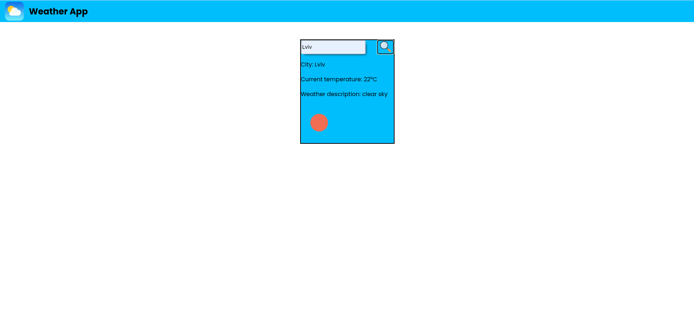

## 🌦️ Weather App  

A simple and clean weather app that shows **real-time weather data** for any city you search.  
Powered by **OpenWeather API** + **Geocode API**.  

## ✨ Features  
- 🔍 Search weather by city  
- 🌡 Shows temperature in °C  
- 📜 Weather description & icon  
- 🚫 Error notification for invalid city  
- 🎨 Simple UI + animations  

## 🛠 Tech Stack  
- HTML5 + CSS3 + JavaScript (Vanilla)  
- OpenWeather API  
- Geocode API  

## 🚀 How to Run  
```bash
git clone https://github.com/yari4ek89/weather-app.git
```
Open `index.html` in your browser.  

## 🔑 API Keys  
Get your free API keys:  
- [🌤 OpenWeather](https://openweathermap.org/api)  
- [📍 Geocode](https://geocode.maps.co/)  

Add them in `script.js`:  
```javascript
const GEOCODE_API = 'YOUR_KEY';
const WEATHER_API = 'YOUR_KEY';
```

## 📸 Preview  


## 🌍 Live Demo
[Open Weather App in your browser](yari4ek89.github.io/weather-app)